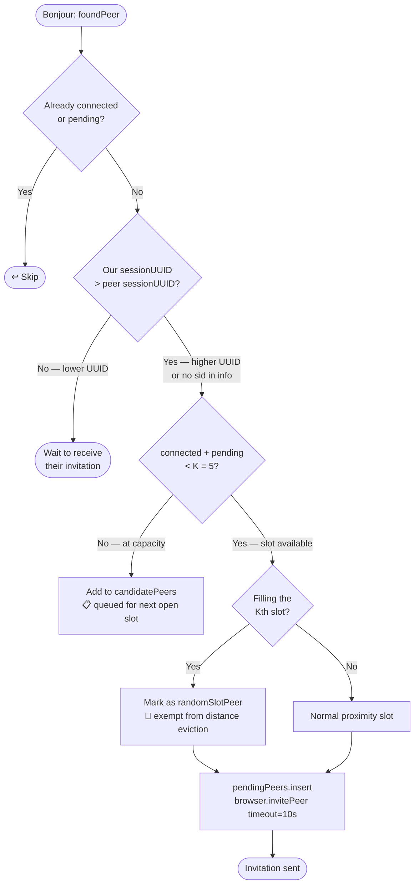
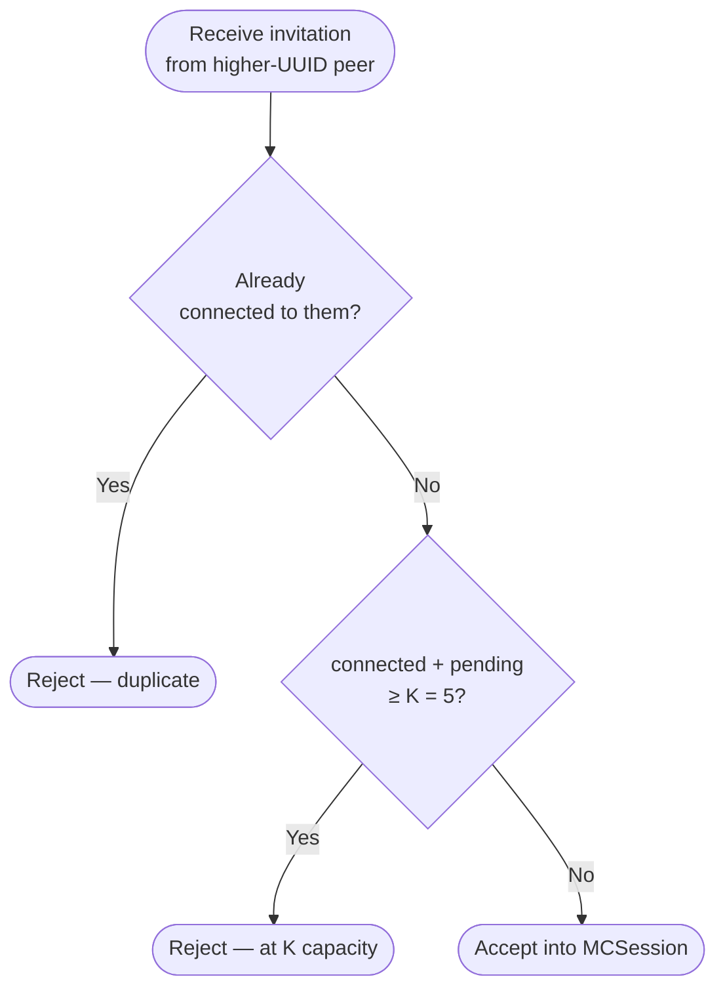
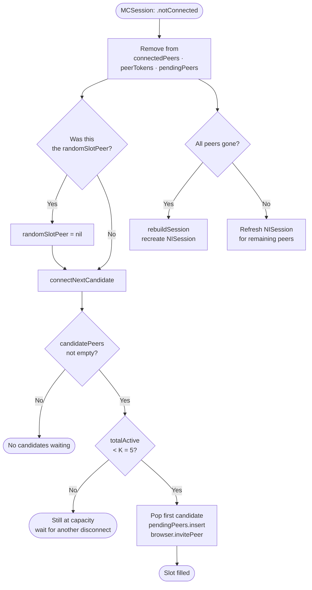
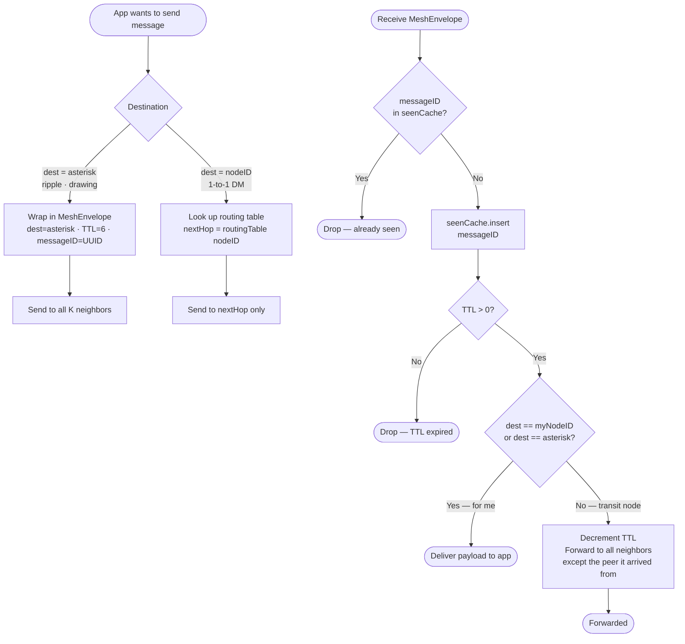
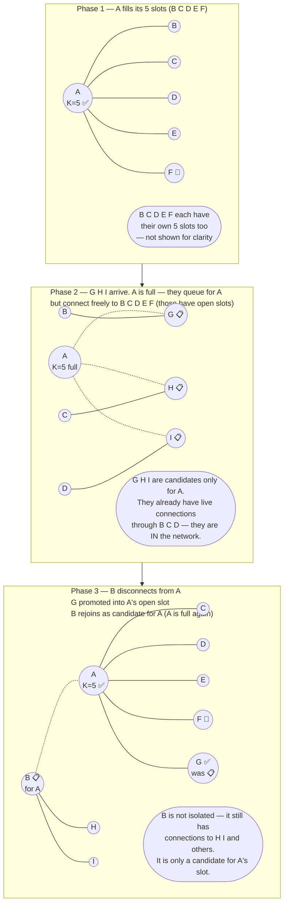

# Large-Scale Mesh Networking for PartyMesh

## The Core Reality: MCSession Caps at 8 Peers

The current code uses **one MCSession** and connects to **every peer it finds**. Apple hard-limits MCSession to **8 simultaneous peers**. At a party of 30, 50, 100+ people this architecture completely breaks. That is the first wall to hit.

---

## Problem Tree

### Problem 1: Topology — Who connects to whom?

**Current (Full Mesh):**

```
A ── B ── C
│ ╲ │ ╱ │
│  ╲│╱  │
D ── E ── F   ← Everyone connects to everyone
```

- O(n²) connections. At 10 people = 45 connections. At 50 = 1,225. Impossible.
- MCSession dies at 8 peers. Period.

**The real question is how to pick your K neighbors.**

Three viable strategies:

| Strategy | How neighbors are chosen | Trade-off |
|---|---|---|
| **Proximity-based** | Connect to K physically nearest peers (NI distance) | Natural for a party. People near you = your graph neighbors |
| **Random K** | Randomly pick K peers from discovered list | Robust, less intuitive |
| **Hybrid** | K nearest + 1–2 random long-range links | Best of both — prevents network partition |

**Recommendation: Proximity K-nearest (K=4–6) + 1 random long-range link per device.**

The random link is critical — pure nearest-neighbor graphs can split into islands (the left side of the room has no path to the right side).

---

### Problem 2: Message Routing — How does A talk to Z (not directly connected)?

This is the hardest problem. The current `session.send(data, toPeers: session.connectedPeers)` only reaches direct neighbors. You need **multi-hop routing**.

Every message must carry a routing envelope:

```swift
struct MeshEnvelope: Codable {
    let messageID: String     // UUID — for deduplication
    let sourceID: String      // stable UUID of origin device
    let destinationID: String // stable UUID of target ("*" = broadcast)
    let ttl: Int              // decremented each hop, drop at 0
    let hopCount: Int         // for diagnostics
    let payload: Data         // RippleMessage / StrokeMessage / ChatMessage
}
```

**For broadcast (ripple, drawing) — Gossip/Flooding with dedup:**

```
A taps → wraps in envelope (TTL=5, dest="*")
A sends to all direct neighbors [B, C, D]
B receives → checks seen-IDs cache → not seen → forwards to [A, E, F] minus A
E receives → not seen → forwards to [B, G, H] minus B
... continues until TTL=0 or all nodes have seen it
```

Each device keeps a `Set<String>` of recently seen `messageID`s (drop after ~30s). Without this, messages loop forever and kill the network.

**For unicast (1-to-1 DM) — Geographic/Proximity Routing:**

Since NearbyInteraction gives you real physical distance, you can route toward the destination's physical location:

```
A wants to message Z
A does not know Z directly
A picks the neighbor whose known distance to Z is smallest → forwards to them
That neighbor repeats → greedy geographic forwarding toward Z
```

This requires distributing a distance table across the network (see Problem 4).

**Fallback — Distance Vector Routing:**

Each node maintains: `routingTable[destinationID] = (nextHopID, hopCount)`
Updated by periodic gossip with neighbors. Simple, converges in seconds.

---

### Problem 3: Stable Addressing

The current code uses `MCPeerID(displayName: UIDevice.current.name)`. Two iPhones both named "iPhone" breaks everything. MCPeerID is also not stable across sessions.

**Fix:** Generate a UUID once per app install, persist it to UserDefaults.

```swift
let stableNodeID: String = {
    if let id = UserDefaults.standard.string(forKey: "nodeID") { return id }
    let id = UUID().uuidString
    UserDefaults.standard.set(id, forKey: "nodeID")
    return id
}()
```

Every message uses `stableNodeID`, not `MCPeerID.displayName`. Include it in `discoveryInfo` so peers know your stable ID before connecting.

---

### Problem 4: Topology Discovery — How does everyone know who exists?

With K-nearest connections, device A only directly knows its 4–6 neighbors. It does not know that Z exists on the other side of the room.

**Solution: Topology Gossip Protocol**

Every device periodically (every 5–10s) broadcasts a `TopologyUpdate`:

```swift
struct TopologyUpdate: Codable {
    let messageType: String   // "topology"
    let nodeID: String        // my stable UUID
    let timestamp: Double     // wall clock
    let neighbors: [NeighborInfo]
}

struct NeighborInfo: Codable {
    let nodeID: String
    let distance: Float  // meters from NearbyInteraction
}
```

This propagates via flooding → every device builds a partial map of the network → routing paths become computable.

---

### Problem 5: Loop Prevention

Without this, a forwarded message bounces between nodes forever and saturates the network.

Two defenses — both are mandatory:

1. **TTL field** (in the envelope): decrement each hop, drop at 0. TTL=6 reaches ~64 nodes in a well-connected graph.
2. **Seen-message cache**: `var seenMessages = Set<String>()` keyed by `messageID`. Drop any message whose ID you have already processed. Expire entries after 60s.

---

### Problem 6: Dynamic Topology (People Move)

At a party, people walk around. Your K-neighbors change constantly.

- **Connect**: When NI distance to a new peer drops below threshold AND you have a free slot → invite them
- **Evict**: When inviting a new closer peer but at K capacity → drop your farthest current neighbor
- **Disconnect**: When NI distance to a current neighbor exceeds a disconnect threshold → disconnect
- **Hysteresis**: Use separate connect-threshold (e.g. 2m) and disconnect-threshold (e.g. 4m) to prevent rapid flapping when someone is right at the boundary

---

### Problem 7: NISession Does Not Scale to the Full Network

`NISession` only gives you distance to **directly MCConnected** peers. There is no NI distance to peers 2+ hops away.

- For routing decisions: you only have physical distance to your direct neighbors
- For the rest of the network: rely on `TopologyUpdate` gossip — each peer shares their distances
- Build a **distributed distance matrix** from accumulated gossip to enable geographic routing across the full network

---

### Problem 8: MCSession Multi-Session Management

Currently there is one MCSession holding all peers. At scale, one session per neighbor is more correct and resilient:

```swift
var neighborSessions: [String: MCSession] = [:]  // stableNodeID → MCSession
```

Each session has exactly 1 peer in it. A crash or disconnect in one connection does not take down all others. This also sidesteps the 8-peer cap since each session only holds 1 peer (the limit is peers per session, not sessions per process).

---

### Problem 9: Message Priority and Reliability Tiers

Not all messages need the same delivery guarantees:

| Message | Reliability | Routing | Reason |
|---|---|---|---|
| Ripple tap | `.unreliable` | TTL flood | Ephemeral, latency > delivery |
| Drawing move | `.unreliable` | TTL flood | Same |
| Drawing begin/end/clear | `.reliable` | TTL flood | Stroke integrity matters |
| 1-to-1 DM | `.reliable` | Unicast route | Must arrive exactly once |
| TopologyUpdate | `.unreliable` | TTL flood | Redundant by design, sent frequently |

---

### Problem 10: Network Partition

In a large venue, if everyone stands in two rooms with nobody in the hallway, the graph splits. Messages from Room A can never reach Room B.

- **Detection**: if `TopologyUpdate` from a known node goes stale (no update in 30s) → mark as unreachable
- **Mitigation**: the random long-range link from Problem 1 significantly reduces partition probability
- **Recovery**: automatic — when someone walks through the connecting space they bridge the partition and routing converges within seconds

---

## Recommended Architecture

```
┌─────────────────────────────────────────────────────┐
│  Each device maintains K=5 direct MCSession links   │
│  (4 nearest by NI distance + 1 random long-range)   │
└─────────────────┬───────────────────────────────────┘
                  │
        ┌─────────▼──────────┐
        │   MeshEnvelope     │  wraps every outgoing message
        │   sourceID         │  stable UUID of sender
        │   destinationID    │  target UUID, or "*" for broadcast
        │   messageID        │  UUID, for deduplication
        │   ttl              │  loop prevention
        │   payload          │  your actual message data
        └─────────┬──────────┘
                  │
       ┌──────────┴──────────┐
       ▼                     ▼
  Broadcast              Unicast
  (ripple/drawing)       (1-to-1 DM)
  TTL Flood +            Distance Vector routing
  Seen-ID dedup          or Geographic routing
                         via gossip topology map
```

---

## Build Order (Incremental, Each Step Ships)

| Step | What to build | Unlocks |
|---|---|---|
| 1 | Stable node UUID in UserDefaults + in discoveryInfo | Correct addressing everywhere |
| 2 | `MeshEnvelope` wrapper around all payloads | Foundation for all routing |
| 3 | Seen-message cache (Set + 60s expiry) | Loop prevention |
| 4 | Per-peer MCSession (one session per neighbor) | Bypasses 8-peer cap |
| 5 | K-neighbor limit with eviction of farthest peer | Bounded connection count |
| 6 | Flood forwarder on receive (TTL > 0, not seen → forward) | Messages cross multiple hops |
| 7 | `TopologyUpdate` gossip (every 5s, TTL flood) | Global peer awareness |
| 8 | Distributed routing table built from gossip | Path knowledge for unicast |
| 9 | Unicast routing via routing table | 1-to-1 messages |
| 10 | Dynamic neighbor churn with hysteresis | Adapts as people move |

Steps 1–6 can be done in a single sprint and immediately scale the app to 50–100+ people for broadcast features (ripple, drawing). Steps 7–10 add the infrastructure for private messaging and full topology awareness.

---

## Key Numbers

| Parameter | Recommended Value | Why |
|---|---|---|
| K (max neighbors) | 5 | 4 nearest + 1 random; well within MCSession limit per session |
| Default TTL | 6 | Reaches ~64 nodes assuming avg degree 4; enough for a large party |
| Connect threshold | 2m | NI distance below which you should connect |
| Disconnect threshold | 4m | NI distance above which you evict (hysteresis gap = 2m) |
| Topology gossip interval | 5s | Fast enough for routing convergence, slow enough for battery |
| Seen-message cache TTL | 60s | Longer than any message's network lifetime |
| Routing table staleness | 30s | Mark node unreachable if no topology update received |

---

## Flow Diagrams

### 1 — Outbound Connection Decision (`browser(_:foundPeer:)`)

Every time Bonjour surfaces a new peer this decision tree runs. It is the core gate
that keeps the local graph bounded at K=5.



---

### 2 — Inbound Invitation Gate (`advertiser(_:didReceiveInvitation:)`)

The higher-UUID peer sends the invitation; the lower-UUID peer decides whether to
accept it. Without this check an aggressive peer could push us over K.



---

### 3 — Disconnect & Slot Recovery (`session(_:peer:didChange:)` → `connectNextCandidate`)

When any peer disconnects a slot opens. The slot is immediately offered to the
first waiting candidate so the graph self-heals without any manual intervention.



---

### 4 — NI Distance Eviction Signal (`session(_:didUpdate:)`)

NearbyInteraction fires distance updates for every connected peer. This flow
logs eviction candidates. Actual disconnect requires per-peer MCSession (Build Step 4).

```mermaid
flowchart TD
    START([NISession: didUpdate]) --> UPDATESTORE[Update connectedPeers\ndistance + direction]
    UPDATESTORE --> DELEGATE[Notify delegate\nfor UI update]
    UPDATESTORE --> DISTKNOWN{Distance\nfield present?}
    DISTKNOWN -->|No| END([Done])
    DISTKNOWN -->|Yes| ISRANDOM{peerID ==\nrandomSlotPeer?}

    ISRANDOM -->|Yes| EXEMPT[Log 🎲 random-slot\nexempt from eviction]
    ISRANDOM -->|No| THRESHOLD{distance >\n4.0 m?}

    THRESHOLD -->|No| INRANGE[Log ✅ within range]
    THRESHOLD -->|Yes| EVICT[Log ⚠️ eviction candidate\nFuture: disconnect + connectNextCandidate\nRequires per-peer MCSession]

    EXEMPT --> END
    INRANGE --> END
    EVICT --> END
```



---

### 5 — Message Routing: Broadcast vs Unicast

Two completely different forwarding paths depending on whether the message
targets everyone (`*`) or a specific node.



---

### 6 — Full Topology Lifecycle (Party scenario, 9 devices)

**Critical rule: K=5 is per device, not per network.**
Every device independently manages its own 5 slots. The network as a whole
can hold unlimited devices — each one connects to up to 5 neighbours of its own.



**Key takeaways:**

| Question | Answer |
|---|---|
| How does B reconnect to A? | B becomes a `📋` candidate for A. When the next slot opens (someone else leaves), `connectNextCandidate` promotes B. |
| How do H and I join the network? | They connect directly to B, C, D, E, or F (those devices have open slots). They don't need A's slot at all. |
| Is H or I isolated while waiting for A's slot? | No. Being a candidate for A just means "not yet connected to A". H and I already have live paths through other peers. |
| What is the total network capacity? | Unlimited. Each new device needs only one open slot anywhere in the graph to join. The K=5 cap keeps the graph *sparse*, not *small*. |

`📋` = candidate for that specific device's slot  ·  `🎲` = random long-range slot (eviction-exempt)  ·  `✅` = active connection
